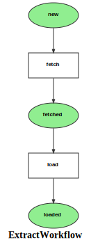

Markdown for ExtractWorkflow




##  -- guard


```php
#[AsGuardListener(self::WORKFLOW_NAME)]
public function onGuard(GuardEvent $event): void
{
    /** @var Extract extract */
    $extract = $event->getSubject();

    switch ($event->getTransition()) {
        case self::TRANSITION_LOAD:
            if ($extract->getNextToken()) {
                $event->setBlocked(true, "probably already processed");
            }
            break;
    }
}
```
blob/main/src/Workflow/ExtractWorkflow.php#L44-56
        


## fetch -- transition


```php
    #[AsTransitionListener(self::WORKFLOW_NAME, self::TRANSITION_FETCH)]
    public function onTransition(TransitionEvent $event): void
    {
        /** @var Extract extract */
        $extract = $event->getSubject();

        // cache during dev only
        $key = $extract->getTokenCode();
//        $data = $this->cache->get($key, function (ItemInterface $item) use ($extract) {
            $response = $this->httpClient->request('GET', $url = $extract->getUrl(), [
                'headers' => [
                    'Accept' => 'application/json',
                ]
            ]);
            if ($response->getStatusCode() !== 200) {
                dd($url);
            }
            $data = $response->toArray();
            $duration =  (int) (1000 * $response->getInfo()['total_time']);
            $extract
                ->setDuration($duration);

//            return $data;
//        });

        $stats = $data['stats'];
        $remaining = $stats['remaining'];


        $extract
            ->setResponse($data) // redundant: separate message that received the data and source. Even a separate queue
            ->setStats($stats)
            ->setRemaining($remaining)
            ->setResponse($data) // for debugging, but huge!  maybe for re-processing
            ->setLatency($stats['latency']);;

        $nextToken = $data['resume'] ?? null;
        $remaining = $stats['remaining'];
        if ($remaining) {
            if ($data['has_next']) {
                $nextToken = $data['resume'];
                $extract
                    ->setRemaining($remaining)
                    ->setNextToken($nextToken);
                $extract->setNextToken($nextToken);
                $next = $this->findOrGet($nextToken, $extract->getGrp());
                // flush before dispatching?

                // skip if next is already in the database? maybe we need a marking. :-(
                // not if sync!
//                $envelope = $this->messageBus->dispatch(new ExtractMessage($nextToken));
                $envelope = $this->messageBus->dispatch(new TransitionMessage(
                    $next->getTokenCode(),
                    Extract::class,
                    IExtractWorkflow::TRANSITION_FETCH,
                    IExtractWorkflow::WORKFLOW_NAME,
                ));
                $this->logger->warning("dispatched " . $next->getTokenCode());
            }
        } else {
            $this->logger->error("All done");
        }

        $this->entityManager->flush(); // this happens in the caller, right?

        // the records are handled in another process to not slow down the fetch
        if ($extract->getGrp()) {

        }
        $this->messageBus->dispatch(new ExtractMessage(
            (string)$extract->getGrp()->getCode(),
            (string)$extract->getTokenCode(),
            $data));


    }
```
blob/main/src/Workflow/ExtractWorkflow.php#L60-134
        
