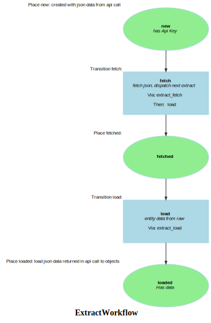

Markdown for ExtractWorkflow




---
## Transition: fetch

### fetch.Transition

onFetch()
        // fetch json, dispatch next extract
        // 

```php
    #[AsTransitionListener(self::WORKFLOW_NAME, self::TRANSITION_FETCH)]
    public function onFetch(TransitionEvent $event): array
    {
        $extract = $this->getExtract($event);
        $this->logger->warning($extract->getUrl());

        // cache during dev only
        $key = $extract->getTokenCode();
        $this->logger->info("not! Checking cache for $key");
//        $data = $this->cache->get($key, function (ItemInterface $item) use ($extract, $key){
            $this->logger->info("$key not in cache, so fetching...");
            $response = $this->httpClient->request('GET', $url = $extract->getUrl(), [
                'headers' => [
                    'Accept' => 'application/json',
                ]
            ]);
            $this->logger->info("Status code: " . $response->getStatusCode());
            if ($response->getStatusCode() !== 200) {
                dd($url);
            }
            $data = $response->toArray();
            $duration = (int)(1000 * $response->getInfo()['total_time']);
            $extract
                ->setDuration($duration);

//            return $data;
//        });

        $stats = $data['stats'];
        $remaining = $stats['remaining'];

        $extract
            ->setResponse($data) // redundant: separate message that received the data and source. Even a separate queue
            ->setStats($stats)
            ->setRemaining($remaining)
            ->setResponse($data) // for debugging, but huge!  maybe for re-processing
            ->setLatency($stats['latency']);;

        if ($nextToken = $data['resume']??null) {
            $extract
                ->setRemaining($remaining)
                ->setNextToken($nextToken);
        }
        $this->entityManager->flush();
        return [
            'url' => $url,
            'duration' => $duration
        ];

    }
```
[View source](mds/blob/main/src/Workflow/ExtractWorkflow.php#L135-L183)

### fetch.Completed

onFetchComplete()
        // fetch json, dispatch next extract
        // 

```php
#[AsCompletedListener(self::WORKFLOW_NAME, self::TRANSITION_FETCH)]
public function onFetchComplete(CompletedEvent $event): void
{
    $extract = $this->getExtract($event);
    // we're complete, create a new event if there's a next token.
    // @todo: guard?
    if ($nextToken = $extract->getNextToken()) {
        $this->dispatchNextExtract($nextToken, $extract);
    } else {
        $this->logger->error("All done");
    }
}
```
[View source](mds/blob/main/src/Workflow/ExtractWorkflow.php#L186-L196)


---
## Transition: load

### load.Transition

onLoadFromExtractData()
        // entity data from raw
        // 

```php
#[AsTransitionListener(self::WORKFLOW_NAME, self::TRANSITION_LOAD)]
public function onLoadFromExtractData(TransitionEvent $event): array
{
    $extract = $this->getExtract($event);
    $objs = $this->museumObjectExtractor->extract($extract->getResponse(), $extract);
    return [
        'objects loaded' => count($objs)
    ];

    $grp = $extract->getGrp();
    $data = $extract->getResponse()['data'];
    foreach ($data as $idx => $item) {
        $obj = $this->museumObjectExtractor->extract($item);
        dd($item, $obj);
        // there can be multiple identifiers.  use the admin uuid if it exists
        assert(array_key_exists('@admin', $item), "no @admin in #$idx of $message->tokenCode");
        $admin = $item['@admin'];
        $id = $admin['uuid'];

        SurvosUtils::assertKeyExists('data_source', $admin);
        $sourceData = $admin['data_source'];
        $sourceCode = $sourceData['code'];
        // flush after each...
        // this is the REAL source, not the grp
        if (array_key_exists($sourceCode, $this->seen)) {
            $source = $this->seen[$sourceCode];
        } elseif (!$source = $this->sourceRepository->findOneBy(['code' => $sourceCode])) {
            assert($sourceData['code'] == $sourceCode, $sourceData['code'] . "<> $sourceCode");
            // @todo: add the group here.
            $source = new Source($sourceCode, $sourceData['name'], $sourceData['organisation'], $sourceData['group']);
            $this->entityManager->persist($source);
            $this->entityManager->flush();
            $this->seen[$sourceCode] = $source;
        }

        // if it already exists, assume we also have the source
        $uuid = new Uuid($id);
        if ($record = $this->recordRepository->find($uuid)) {
            assert($record->getSource() == $source);
            continue;
        } else {
            $record = new Record($uuid, $source, $item, $extract);
            $this->entityManager->persist($record);
            $this->entityManager->flush();
        }
    }
    $this->entityManager->flush();


}
```
[View source](mds/blob/main/src/Workflow/ExtractWorkflow.php#L83-L132)


