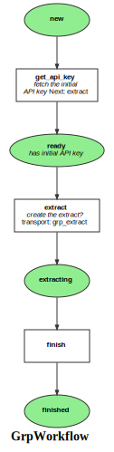

Markdown for GrpWorkflow




##  -- guard


```php
#[AsGuardListener(self::WORKFLOW_NAME)]
public function onGuard(GuardEvent $event): void
{
    /** @var Grp grp */
    $grp = $event->getSubject();

    switch ($event->getTransition()) {
    /*
    e.g.
    if ($event->getSubject()->cannotTransition()) {
      $event->setBlocked(true, "reason");
    }
    App\Entity\Grp
    */
        case self::TRANSITION_DISPATCH:
            break;
        case self::TRANSITION_FINISH:
            break;
    }
}
```
blob/main/src/Workflow/GrpWorkflow.php#L23-41
        


##  -- transition


```php
#[AsTransitionListener(self::WORKFLOW_NAME)]
public function onTransition(TransitionEvent $event): void
{
    /** @var Grp grp */
    $grp = $event->getSubject();

    switch ($event->getTransition()) {
    /*
    e.g.
    if ($event->getSubject()->cannotTransition()) {
      $event->setBlocked(true, "reason");
    }
    App\Entity\Grp
    */
        case self::TRANSITION_DISPATCH:
            break;
        case self::TRANSITION_FINISH:
            break;
    }
}
```
blob/main/src/Workflow/GrpWorkflow.php#L45-63
        
