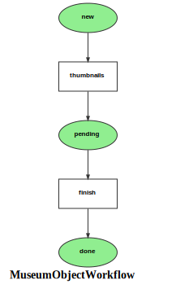

Markdown for MuseumObjectWorkflow




---
## Transition: thumbnails

### thumbnails.Transition

        onThumbnails()
        // 
```php
#[AsTransitionListener(self::WORKFLOW_NAME, self::TRANSITION_THUMBNAILS)]
public function onThumbnails(TransitionEvent $event): void
{
    $museumObject = $this->getMuseumObject($event);
}
```
[View source](mds/blob/main/src/Workflow/MuseumObjectWorkflow.php#L50-L53)


---
## Transition: finish

### finish.Transition

        onFinish()
        // 
```php
#[AsTransitionListener(self::WORKFLOW_NAME, self::TRANSITION_FINISH)]
public function onFinish(TransitionEvent $event): void
{
    $museumObject = $this->getMuseumObject($event);
}
```
[View source](mds/blob/main/src/Workflow/MuseumObjectWorkflow.php#L57-L60)


