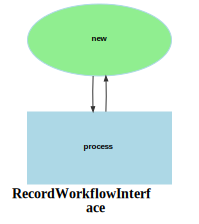

Markdown for RecordWorkflowInterface




##  -- guard


```php
#[AsGuardListener(self::WORKFLOW_NAME)]
public function onGuard(GuardEvent $event): void
{
    // switch ($event->getTransition()) { ...
}
```
blob/main/src/Workflow/RecordWorkflow.php#L33-36
        


## process -- transition


```php
#[AsTransitionListener(self::WORKFLOW_NAME, self::TRANSITION_PROCESS)]
public function onTransition(TransitionEvent $event): void
{
    $record = $this->getRecord($event);
    dd($record);
    switch ($event->getTransition()->getName()) {
        case self::TRANSITION_PROCESS:
            break;
    }
}
```
blob/main/src/Workflow/RecordWorkflow.php#L39-47
        
